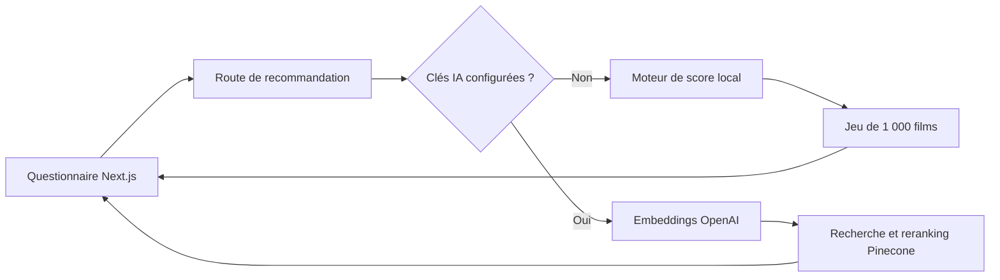

<h1 align="center">🎬 Movie Recommender</h1>

<p align="center">
  Un moteur de recommandation de films selon les goûts, l'âge et l'humeur de l'utilisateur.
</p>

<p align="center">
  
  
  
  
  
</p>

## À propos

L'application propose des films à partir d'un questionnaire portant sur les films favoris, les genres appréciés, l'âge et l'humeur. Elle contient un jeu local de **1 000 films** et fonctionne selon deux modes :

- un moteur local déterministe, disponible sans compte ni clé API ;
- un moteur optionnel combinant embeddings OpenAI, recherche vectorielle et reranking Pinecone.

## Architecture



## Fonctionnalités

- sélection de plusieurs films et genres favoris ;
- prise en compte de l'humeur et de la tranche d'âge ;
- exclusion des films déjà vus grâce au stockage local du navigateur ;
- classement local par genres, réalisateur, distribution et note ;
- recherche sémantique optionnelle avec Pinecone ;
- présentation des résultats sous forme de cartes plein écran.

## Lancer le projet en local

### Prérequis

- Node.js 20.9 ou version ultérieure ;
- npm 10 ou version ultérieure.

```bash
git clone https://github.com/christophersemard/movie-recommender.git
cd movie-recommender
npm ci
npm run dev
```

Ouvrir ensuite `http://localhost:3000`. Aucune variable d'environnement n'est nécessaire pour utiliser le moteur local.

### Activer OpenAI et Pinecone

```bash
cp .env.example .env.local
```

Renseigner les trois variables requises dans `.env.local`. L'index Pinecone doit contenir des vecteurs produits avec le modèle indiqué par `OPENAI_EMBEDDING_MODEL` et les métadonnées suivantes : `title`, `genres`, `synopsis`, `releaseDate`, `vote_average`, `cast`, `director` et `posterUrl`.

## Vérifications

```bash
npm test
npm run lint
npm run build
```

## Limites connues

- Le score local constitue une heuristique de démonstration, pas un modèle de machine learning.
- Le mode IA nécessite des comptes OpenAI et Pinecone ainsi qu'un index déjà alimenté.
- Les films sont issus d'un jeu de données pédagogique statique ; les informations ne sont donc pas actualisées.
- Les affiches distantes utilisent le domaine d'images TMDB. Les droits et conditions de réutilisation doivent être contrôlés avant tout usage commercial.

> Documentation de projet revue en août 2026.

## Auteur

Projet réalisé par [Christopher Semard](https://github.com/christophersemard) dans le cadre de sa formation en développement full-stack.
